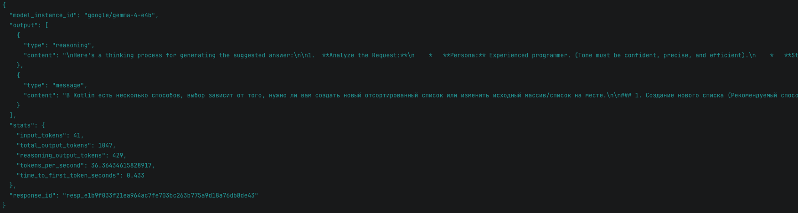
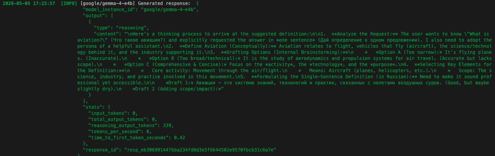
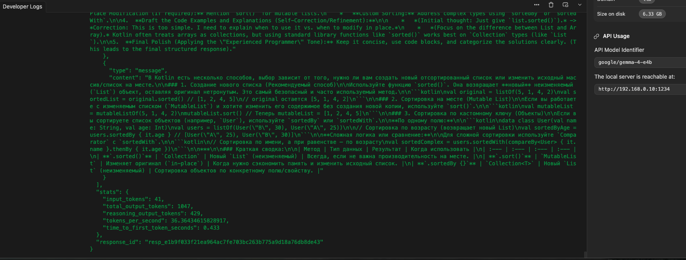

Android project with integration of the AI model google/gemma-4-e4b (via LM Studio). A basic chat interface is implemented: the user enters an arbitrary message, and the system processes the request. The code includes a preset context: the user is positioned as an experienced programmer who needs help sorting an array in Kotlin.
Cogito ergo sum ...

Server - LmStudio with uploaded model: google-gemma-4-e4b

Как запустить сервер искусственного интеллекта в LM Studio (на русском)
Установите LM Studio. Скачайте и установите последнюю версию программы с официального сайта.

Загрузите модель ИИ.

Откройте LM Studio.

Перейдите во вкладку Models («Модели»).

Найдите нужную модель (например, Llama, Mistral и т. д.) через поиск или выберите из популярных.

Нажмите Download («Скачать»), чтобы загрузить модель на компьютер.

Загрузите модель в память.

После загрузки перейдите во вкладку Local Server («Локальный сервер»).

В разделе Model («Модель») выберите загруженную ранее модель из выпадающего списка.

Нажмите кнопку Load Model («Загрузить модель») — начнётся загрузка модели в оперативную память. Дождитесь завершения процесса (может занять несколько минут в зависимости от мощности ПК и размера модели).

Запустите локальный сервер.

Убедитесь, что модель успешно загружена (появится сообщение о готовности).

В разделе Local Server найдите настройки сервера:

Host («Хост») — обычно оставьте значение по умолчанию (127.0.0.1).

Port («Порт») — по умолчанию используется порт 1234. При необходимости измените его.

Нажмите кнопку Start Server («Запустить сервер»). Вы увидите сообщение о том, что сервер запущен и слушает указанный порт.

Проверьте работу сервера.

Откройте веб‑браузер и перейдите по адресу: http://127.0.0.1:1234/v1.

Если сервер работает корректно, вы получите ответ в формате JSON (например, информацию о доступных эндпоинтах).

Используйте сервер. Теперь вы можете отправлять API‑запросы к вашему локальному серверу (например, через curl, Python‑скрипты или другие инструменты), чтобы взаимодействовать с моделью ИИ.

How to run an AI server in LM Studio (in English)
Install LM Studio. Download and install the latest version of the software from the official website.

Download an AI model.

Open LM Studio.

Go to the Models tab.

Search for the desired model (e.g., Llama, Mistral, etc.) or pick one from the popular list.

Click Download to save the model to your computer.

Load the model into memory.

After downloading, go to the Local Server tab.

In the Model section, select the previously downloaded model from the dropdown list.

Click Load Model. The model will start loading into RAM. Wait for the process to complete (it may take several minutes depending on your PC’s power and the model’s size).

Start the local server.

Make sure the model is loaded successfully (you’ll see a ready message).

In the Local Server section, check the server settings:

Host — usually keep the default value (127.0.0.1).

Port — the default port is 1234. Change it if needed.

Click Start Server. You’ll see a message confirming the server is running and listening on the specified port.

Test the server.

Open a web browser and go to: http://127.0.0.1:1234/v1.

If the server works correctly, you’ll get a JSON response (e.g., info about available endpoints).

Use the server. Now you can send API requests to your local server (via curl, Python scripts, or other tools) to interact with the AI model.
